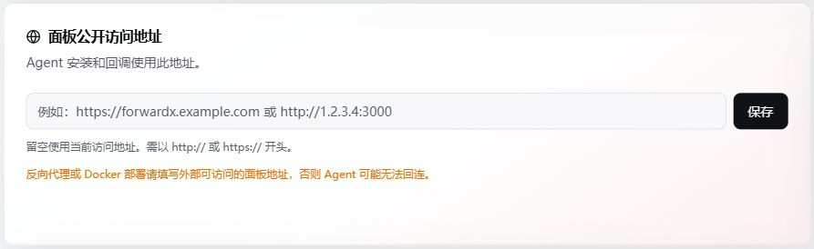

# 首次初始化

浏览器打开面板地址：

```text
http://服务器IP:9810
```

首次访问会自动进入初始化向导，按顺序完成以下步骤即可。

## 第一步：选择数据库

ForwardX 支持三种数据库：

| 数据库 | 适合谁 | 需要提前准备 |
| --- | --- | --- |
| SQLite | 新手、小规模、单机使用 | 不需要，面板自动使用本地数据文件 |
| MySQL | 生产环境、长期使用、多用户 | MySQL 8.0.13 或以上版本、账号和数据库 |
| PostgreSQL | 已有 PostgreSQL 环境的用户 | PostgreSQL 12 或以上版本、账号和数据库 |

选择建议：

- 不确定怎么选，就先选 SQLite，随时可以迁移。
- 用户量增加、规则变多后，可以迁移到 MySQL 或 PostgreSQL。
- 已有现成数据库服务器的，直接选对应类型即可。

SQLite 不需要填写连接信息，面板会自动管理本地文件。

MySQL 和 PostgreSQL 需要填写：

- 数据库地址
- 端口
- 用户名
- 密码
- 数据库名
- 是否启用 SSL

填写完成后先点击"测试连接"，连接成功后才能继续。

::: tip Docker 用户
面板通过 Docker 部署时，数据库地址要填写面板容器内部能访问到的地址。数据库在同一个 compose 网络中时，填写数据库服务名；数据库在宿主机上时，填写宿主机内网 IP。不要直接填 `127.0.0.1`，那会指向容器自身。
:::

::: warning 连接失败排查
容器日志出现 `getaddrinfo ENOTFOUND 数据库地址` 时，说明面板容器无法解析该主机名。检查数据库容器和面板容器是否在同一 Docker 网络，或改用面板能直接访问的 IP/域名。
:::

## 第二步：创建管理员账号

数据库连接成功后，创建第一个管理员账号，填写管理员邮箱、密码并再次确认密码即可。管理员邮箱登录时不区分大小写。

管理员拥有完整权限，包括：

- 管理用户和套餐计费
- 管理主机和 Agent
- 管理转发规则、链路、隧道、转发组
- 配置系统设置、Telegram 通知、邮件、DDNS
- 执行面板和 Agent 升级

创建完成后用该账号登录面板。

## 第三步：设置面板公开地址

登录后第一时间进入：

```text
系统设置 -> 系统信息
```

填写"面板公开地址"。



没有域名时填写：

```text
http://服务器IP:9810
```

已配置 HTTPS 域名时填写：

```text
https://panel.example.com
```

::: warning 必须完成此步骤
面板公开地址直接影响 Agent 安装脚本生成、Agent 自动升级和 Agent 与面板的通讯。如果后续面板 IP 或域名发生变化，必须及时回来修改，否则已安装的 Agent 将无法正常连接。
:::

## 第四步：创建 Agent Token

Agent Token 用于让服务器注册到当前面板。进入：

```text
主机管理 -> Token 管理
```

点击"添加 Token"，填写名称后保存。

Token 创建完成后，点击对应 Token 的"安装命令"，面板会生成包含该 Token 和面板地址的一键安装命令。复制命令后在需要管理的 Linux 服务器上执行，Agent 即可自动注册上线。

安装命令格式类似：

```bash
curl -fsSL http://你的面板地址:9810/api/agent/install.sh | bash -s -- install YOUR_AGENT_TOKEN
```

::: tip
一个 Token 只绑定一台服务器；需要接入多台服务器时，请分别创建 Token。安装后在「主机管理」页面看到绿色在线状态，说明 Agent 已成功连接面板。
:::
