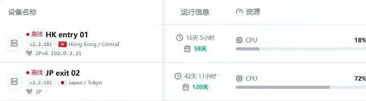

# 主机管理

主机管理用于查看和维护所有已接入的 Agent 主机。

## 主机列表

主机列表展示每台主机的实时状态，包括：

- **在线/离线状态** — 绿色表示在线，红色表示离线。
- **延迟** — 面板与 Agent 之间的往返延迟，反映连接质量。
- **Agent 版本** — 当前运行的 Agent 版本号。
- **CPU、内存、磁盘占用** — 主机资源使用情况。
- **系统负载** — 系统平均负载。
- **公网 IPv4 / IPv6** — Agent 检测到的公网地址。
- **内网 IP** — 主机内网地址。
- **网卡信息** — 网络接口列表。
- **转发状态** — 当前转发规则的运行情况。
- **流量数据** — 累计上下行流量统计。



## 在线与离线

绿色表示在线，红色表示离线。

如果主机离线，常见原因：

- Agent 服务没有运行。
- Agent 配置中的面板地址不对。
- 面板域名、端口或反向代理不可访问。
- 服务器防火墙阻止连接。
- 面板公开地址修改后，Agent 还在使用旧地址。

在 Agent 主机上可以查看日志排查：

```bash
journalctl -u forwardx-agent -n 300 --no-pager
```

Agent 配置文件位于 `/etc/forwardx/agent/config.json`，日志目录位于 `/var/log/forwardx-agent/`。

## 主机信息维护

建议给每台主机填写清晰的名称，例如：

```text
香港入口-1
日本落地-1
美国中转-1
```

也可以设置：

- **备注** — 记录主机用途或额外说明。
- **手动入口 IP 或域名** — 覆盖自动检测的公网地址。
- **DDNS 域名** — 绑定动态域名，支持 DDNS 故障转移。
- **网卡名称** — 指定流量统计所使用的网卡。

主机名越清楚，后续创建转发规则、隧道和链路时越不容易选错。

## 主机分配给用户

可以将主机分配给指定用户，限制其只能使用授权主机上的资源：

- 进入主机详情，在「分配用户」中选择目标用户。
- 未分配主机的用户在创建转发规则或隧道时看不到该主机。
- 管理员始终可以访问全部主机，不受分配限制。

结合套餐计费和用户权限，可以实现多租户隔离。

## 主机排序

主机管理中的排序通过拖动完成，不需要手动填写排序数字。

- **无分组时** — 在主机列表中直接拖动调整顺序。
- **有分组时** — 「全部」视图按分组顺序汇总展示，不支持直接拖动。切换到具体分组后，只调整该分组内的主机顺序。
- 主机分组、Agent Token 和主机探测服务也支持拖动排序。

## mimic 环境检测

mimic 是基于 eBPF 的 UDP 混淆方案（来自 [hack3ric/mimic](https://github.com/hack3ric/mimic)，GPL-2.0-only，当前版本 v0.7.1），需要满足特定的内核与权限条件。面板会自动检测每台主机的 mimic 运行环境，并在主机列表中显示检测结果：

| 状态 | 含义 |
|------|------|
| 支持 | 内核版本 ≥ 6.1，XDP 入站和 TC 出站 eBPF 钩子可用，可正常使用 mimic |
| 内核版本不足 | 当前内核版本低于 6.1，不支持所需的 eBPF 特性 |
| eBPF 不可用 | 系统未加载必要的 eBPF 模块或缺少相应权限 |
| 未检测 | Agent 版本过旧或检测尚未完成 |

如果需要使用 mimic UDP 混淆功能，请确保主机内核版本不低于 Linux 6.1，并确认 XDP 入站和 TC 出站 eBPF 功能可用。Agent 会在 XDP `native` 与 `skb` 模式之间自动回退，无需在面板手动切换。

## IPv6 检测

如果 IPv6 地址检测不到，先确认服务器自身是否有可用 IPv6：

```bash
ip -6 addr show scope global
ip -6 route
ping -6 -c 4 2606:4700:4700::1111
```

如果服务器只有内网 IPv6 或 IPv6 不可出站，面板可能无法将其作为可用入口展示。
