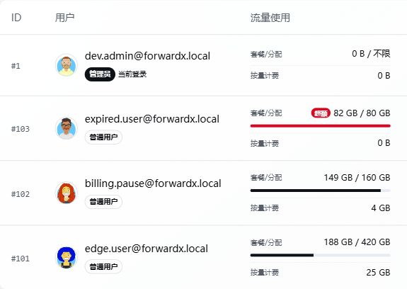

# 用户、套餐和权限

管理员可以在面板中管理用户和套餐。

常见功能：

- 创建用户。
- 设置用户到期时间。
- 设置流量额度。
- 设置最大规则数、端口数。
- 分配可用端口转发、隧道、转发链或转发组资源。
- 配置套餐和价格。
- 配置余额、兑换码、折扣码。
- 配置邮件提醒或 Telegram 提醒。

## 新手建议

如果你只自己使用，可以先不用配置复杂套餐，只保留管理员账户和基础规则即可。

如果要开放给用户使用，建议先规划：

- 每个用户最多可以创建多少规则。
- 每个用户最多可以使用多少端口。
- 每个用户能使用哪些端口转发、隧道、转发链或转发组。
- 流量超额后如何处理。
- 到期前是否发送提醒。

## 权限分配

权限分配要遵循最小可用原则。

例如，一个用户只需要使用香港入口，就不要把所有端口转发和链路资源都分配给他。这样可以降低误操作风险，也方便后续统计和排查。

## 流量统计与重置

用户列表中的“流量使用”分为两项：

| 统计项 | 含义 |
| --- | --- |
| 套餐/分配 | 用户套餐或管理员分配额度内的已用流量，用于额度和超额状态判断 |
| 按量计费 | 按流量计费规则累计的使用量，便于单独核对计费流量 |

管理员可在目标用户的“更多”菜单中选择“重置流量统计”。手动重置会把页面显示的套餐/分配流量和按量计费流量都从零重新统计，但不会撤销已经产生的扣费记录，也不会修改用户余额。

套餐的定时重置仍只重置套餐/分配流量，不会改变按量计费统计。需要同时重新统计两项时，应使用用户列表中的手动重置操作。

